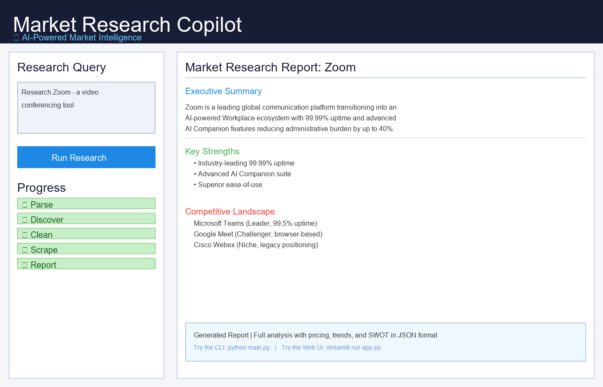

# Market Research Copilot

AI-powered market research automation for SaaS and product analysis.

## Project Overview

This project collects information from Google Search, Google News, and Google Trends, then uses an LLM to generate a structured market research report. It supports both a command-line workflow and an interactive Streamlit UI.

## Key Features

- Query parsing with Google Gemini
- Search, news, and trends discovery via SerpAPI
- Intelligent result cleaning and deduplication
- Article scraping using Trafilatura
- JSON market research report generation
- Streamlit web interface for easy interaction

## Streamlit UI

The Streamlit app provides an interactive interface for running market research queries, viewing progress, and displaying the final structured report.

- Enter a natural language query like: `Research Zoom - a video conferencing tool`
- Watch the pipeline stages: Parse → Discover → Clean → Scrape → Report
- View the generated market research output directly in the browser

### 🎨 User Interface Preview



**Features visible in the UI:**
- **Query Input Panel** (Left) — Enter your research prompt naturally
- **Progress Tracker** — Real-time visualization of all pipeline stages
- **Results Display** (Right) — Executive summary, competitive analysis, pricing, trends, and SWOT analysis
- **Dark Professional Theme** — Built with Streamlit's premium design
- **One-Click Export** — Results available in JSON format for further analysis

### Quick Start with Streamlit

```bash
streamlit run app.py
```

Then navigate to `http://localhost:8501` and enter your research query!

## Repository Structure

- `app.py` — Streamlit UI entry point
- `main.py` — CLI entry point
- `graph/` — workflow and pipeline nodes
- `llm/` — query parsing and report synthesis
- `tools/` — SerpAPI and web scraping utilities
- `cleaners/` — result cleaning and normalization
- `requirements.txt` — Python dependencies
- `.gitignore` — files excluded from git commits

## Setup

### 1. Install dependencies

```bash
cd "c:\Users\proum\Documents\Agent_AI_W2\1yZguFrJR4eBuLaHXIYn_Market-Research-Copilot\Market-Research-Copilot"
pip install -r requirements.txt
```

### 2. Configure environment variables

Create a `.env` file in the project root with:

```env
SERP_API_KEY=your_serp_api_key_here
GOOGLE_API_KEY=your_google_api_key_here
```

### 3. Run the CLI tool

```bash
python main.py
```

### 4. Run the Streamlit app

```bash
streamlit run app.py
```

Then open the local URL shown in the terminal (usually `http://localhost:8501`).

## Notes

- Do not commit `.env` or generated reports.
- The repository already includes `.gitignore` to protect sensitive files.
- If you want to use your own query, replace the `query` value in `main.py` or enter it via the Streamlit UI.

## GitHub Pages

This repo includes a `docs/` folder so you can host project documentation with GitHub Pages.

### Enable GitHub Pages

1. Go to your repository settings on GitHub.
2. Under **Pages**, set the source to the `docs` folder on the `main` branch.
3. Save and wait for the page to publish.

## License

Use this project for learning or prototyping. Update the license section as needed.
